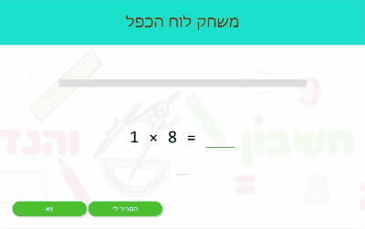

[](https://github.com/gullerya/spotlight)
[](https://www.npmjs.com/package/@gullerya/spotlight)
[](https://travis-ci.org/gullerya/spotlight)
[](https://codecov.io/gh/gullerya/spotlight/branch/master)
[](https://www.codacy.com/app/gullerya/spotlight)

# Summary

__`spotlight`__ let's you to visually highlight a chosen element; this is done by shading over the surrounding content

Below is an example of `spotlight` used in a `callout` framework:



#### Support matrix: <sub>61+</sub> | <sub>60+</sub> | <sub>16+</sub>

#### Last versions (full changelog is [here](docs/changelog.md))

* __1.5.1__
  * Implemented [Issue #4](https://github.com/gullerya/spotlight/issues/4) - raised the default opacity of shadow to `0.8`
  * Implemented [Issue #5](https://github.com/gullerya/spotlight/issues/5) - `shadowColor` is overridable by both initial options and property on the living `spotlight-scene`

* __1.4.0__
  * Implemented [Issue #2](https://github.com/gullerya/spotlight/issues/2) - allow to create spotlight without a target for the beginning
  * overrode `getBoundingClientRect` method to return useful dimensions of the spotted area
  * minor styling adjustements of the transitions

* __1.3.2__
  * Fixed [Issue #1](https://github.com/gullerya/spotlight/issues/1) - misposition of the inner fence on window resize
  * minor styling adjustements of the inner fence

# Base API
`spotlight` library consists of a single entry-level API,
allowing to create a `spotlight-scene` with a given parameters,
applied to the DOM.

Additionally, some constant enumerators provided for convenience.

This component may then be further interacted via component's own APIs as described below, to change its appearance, flavor or spot target,
and to be removed at the end of usage.

Each `spotlight-scene` is self-contained and isolated,
therefore it is possible to create as many 'spotlights' as needed,
even if in the real use-cases one would rarely need more than a single instance.

#### import:
Import the library and it's constants as in example below:
```javascript
import { spotlight, SHAPES } from './dist/spotlight.min.js';
```

#### syntax:
Imported `spotlight` is a function syntaxed as below:
```javascript
const slsElement = function spotlight(target[, container[, options]]) { ... }
```

#### parameters:
* `target` <small>[optional]</small>
    - a target __element__ to place the spot over
    - MAY NOT be a `document.body`
* `container` <small>[optional]</small>
    - a container to shadow contents around the `target`
    - when provided, `container` MUST be an ancestor of the `target`
    - default `container` is `document.body`
* `options` <small>[optional]</small>
    - `shape` - see `shape` property definition below,
    - `shadowColor` - see `shadowColor` property definition below
    - `transitionDuration` - see `transitionDuration` property definition below

# `spotlight-scene` component APIs
The base API outlined above serves as an entry point for the interop
with the library.

The result of that function is the `spotlight-scene` component instance.
It is already applied to the DOM, unless explicitly opted out via the `options` above.

This component may by further interacted via it's own APIs.
Common use-case for this is to move smoothly the spotlight from one element to another, given that all of them are children of the same parent.

Another obvious need is to remove the `spotlight-scene` from the DOM
when not needed anymore.

> In all of the further APIs I'll use `sls` term to represent the concrete
`spotlight-scene` instance that the properties and methods belong to.

#### properties:
* `sls.container` <small>[DOM element] [read only]</small>
    - returns the `container` element that the component was initialized with (see base API above)
    - `container` MAY NOT be changed
* `sls.target` <small>[DOM element]</small> - 'spotted' element
    - setting this property will move the 'spotlight' to another `target`
    - acceptible values are subject to the same constraints as in the main API
        - MUST be an element
        - MUST be a descendend of the `container`
* `sls.shape` <small>[enum]</small> - shape of the spotlight, defaults to `circle`
    - setting this property on a 'living' component will be immediatelly applied
    - acceptible values:
        - `circle`
        - `oval`
        - `box`
    - values better to be taken from the `SHAPES` enum, like `SHAPES.circle`
* `sls.shadowColor` <small>[Array for `rgba` (CSS) function]</small> - valid Array for `rgba` CSS function; defaults to `[0, 0, 0, 0.8]`
    - setting this property will have an immediate effect
* `sls.transitionDuration` <small>[number]</small> - duration in millis of spotlight's transitions (move from target to target, shape change, etc); defaults to `333`
    - setting this property will be effective from the next transition forth

#### methods:
* `sls.close()`
    - returns `Promise`, resolved when all done
    - removes the `spotlight-scene` component and performs all relevant cleanups
* `sls.moveTo(targetElement)`
    - returns `Promise`, resolved when move it finished
    - `targetElement` subject to the same constraints `target` property above
* `sls.getBoundingClientRect()`
    - overrides the native method
    - returns the bounding client rectangle of the spotted area

# Typical usage example
The flow below exemplifies typical usage of the library:
```javascript
const t1 = <... the element to be spotted>;
const t2 = <... another one>;
const t3 = <... another one>;

const sl = spotlight(t1);   //  the spotlight is shown now

...

sl.target = t2;             //  spotlight moved to a new target
sl.style.color = '#110';    //  color of the shade is adjusted...
sl.shape = SHAPES.oval;     //  ... and spot's shape too

...

sl.transitionDuration = 500;    //  slow it down a bit
sl.moveTo(t3)
    .then(() => console.log('spotlight moved, do something...'));

sl.close();
```
